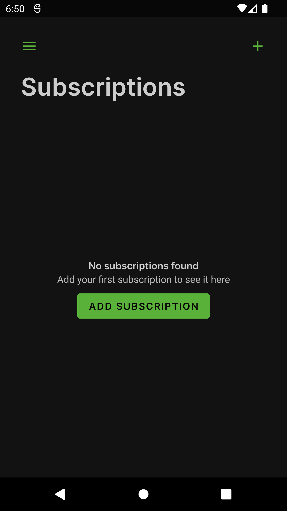
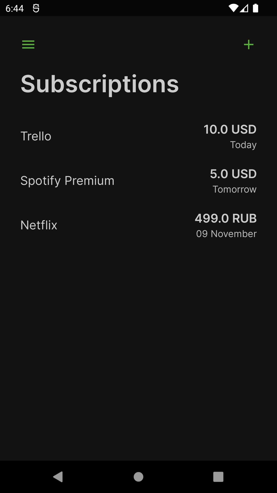
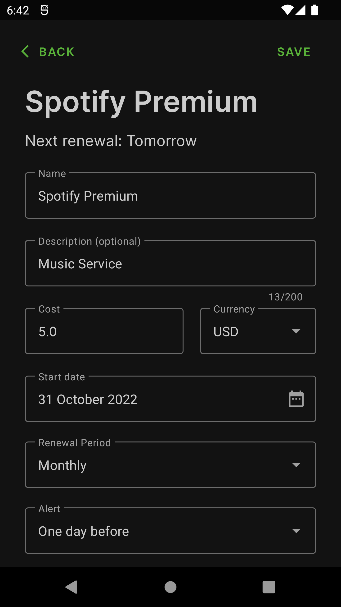

# Subscriptions manager

Offline-first Android application for subscription management and notifications

Tools:
* Kotlin
* Dagger2
* Room
* Navigation Component
* WorkManager
* Notifications
* Kotlin Coroutines
* Kotlin Flow
* LiveData
* RecyclerView
* Shared Preferences

System Design patterns: (app architecture diagram [below](#app-architecture-diagram))
* MVVM
* UseCase
* Repository
* DataSource
* Clean architecture principles

 

## Screenshots
(more screenshots [here](/screenshots))

  

  

 

## App architecture diagram 

