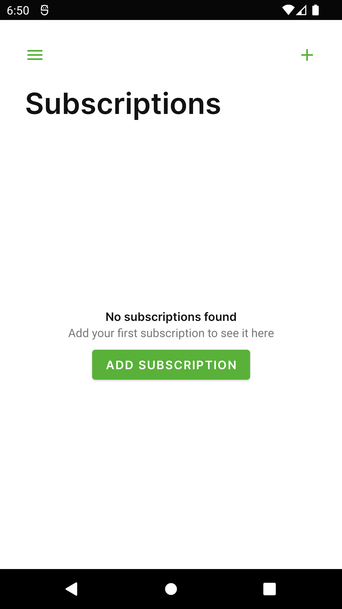
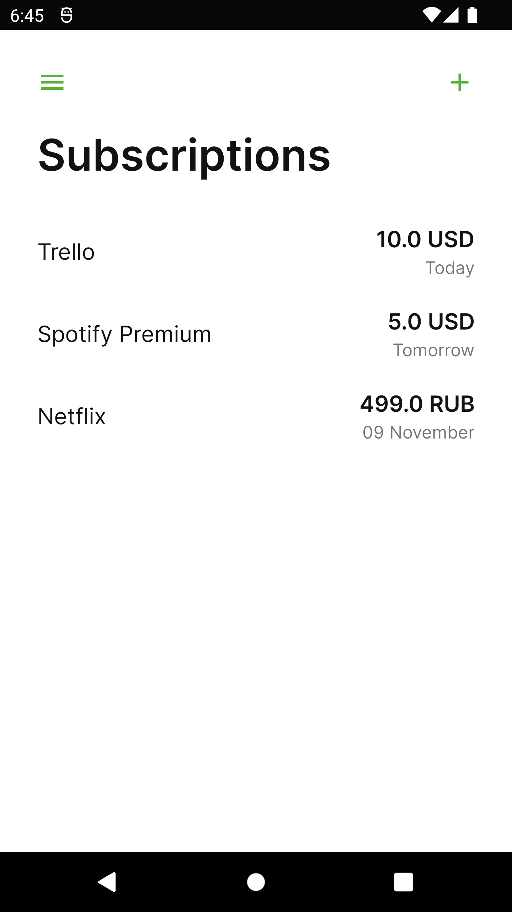

# 📝 Subscriptions manager
Offline-first Android application for subscription management.

Tools:
* Kotlin
* Room
* Koin DI
* Navigation Component
* WorkManager
* Notifications
* Kotlin Coroutines
* Flow
* LiveData
* RecyclerView
* Shared Preferences

System Design patterns: (app architecture diagram [below](#app-architecture-diagram))
* MVVM
* UseCase
* Repository
* DataSource
* Clean architecture principles

## Screenshots
(more screenshots [here](/screenshots))

  

  

 

## App architecture diagram 

